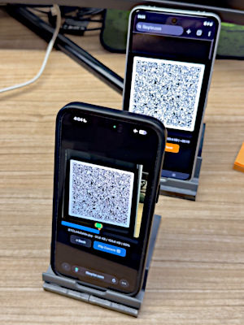
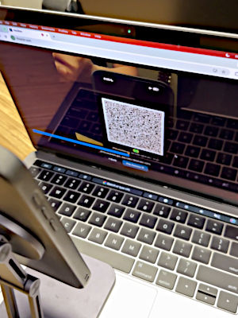

# fileQRier

Air-gapped file transfer through series of QR codes. No wifi, no bluetooth, no internet* -- just camera.

 

## Why

- Air-gapped situation e.g. separate/isolated networks
- Offensive cybersecurity

## Features

- **100% Offline Use**: Aggressive caching, supports PWA Install / Add to Home Screen or download as a single all-in-one HTML file.
- **Progress Seekbar**: Scanning can miss chunks. The sender repeats in loops but we don't have to wait from the beginning, just move the pointer to any part of the file.
- **Relay Mode**: Use phone as a temporary holding device to receive a file from one stationary computer and easily resend it to another.

## Future Enhancements
- Speed improvement: use different libraries, Web Workers API, WASM
- File compression
- Camera manual focus
- Deferred decoding: accept recorded video (high-speed, high-density) to be decoded at a later time (faster with deduced frame-skip)

## How It Works

### Sender

The Sender selects the file to be transmitted. The file is split into multiple chunks according to the selected QR code version (capacity) and ECC level. Each chunk will be byte-encoded as a QR code, displayed successively as a series of QR codes. After the last chunk, the process will be repeated from the first chunk and it will keep looping indefinitely.

Before the very first DATA chunk, a HEADER chunk will be displayed to transmit the file metadata. The HEADER chunk is only shown once and not included in the subsequent loops.

During sending, there is a Progress Seekbar to indicate where the current chunk is. This seekbar works like the one in video player software: the pointer can be moved to any part of the file. This is useful to speed up the recovery process when there are missed chunks that we don't have to wait for the loop to restart from the beginning.

### Receiver

The Receiver can select the front or back camera if supported by the device. The camera is continuously scanning until it detects the HEADER chunk. Once the HEADER chunk is decoded, Progress Map will be shown to visualize the transmission progress. The Progress Map will gradually fill up. If there are missed chunks, the Progress Map can show their locations so the Sender can move its seekbar to make the resending faster.

Once all chunks are received, they will be merged to build the file and verified against the checksum from the metadata in the HEADER chunk. The Receiver can choose to download or relay the file to another device. When it becomes a Relay, the Receiver will transform to Sender and continue with the Sender's workflow.

### Chunk Format

- **HEADER**: type=0x01 (1B) | filesize=uint32 BE (4B) | checksum=SHA-256 (32B) | filename=UTF-8 (variable)
- **DATA**: type=0x02 (1B) | fileoffset=uint32 BE (4B) | payload=raw bytes (variable)

### Caching Strategy / Offline Use

Like other regular applications, internet is needed to open the app *once*. Aggressive caching is implemented using the Fetch, Service Worker, and Cache API with "[cache first with cache refresh"](https://developer.mozilla.org/en-US/docs/Web/Progressive_web_apps/Guides/Caching#cache_first_with_cache_refresh) approach, also known as "stale while revalidate". The website can be Installed (or "Add to Home Screen") as a PWA and will be usable even when the device is offline.

Apart from that, the entire application is contained within a single HTML file, downloadable as a standalone file that can be used locally without a web server.

## Backstory - AI Coding

### June 2026

This was an old idea from 3-4 years ago, triggered by an occasional need to transfer some files in an air-gapped situation (work related). Life happened and it got pushed to the curb until recently.

I was pretty late to board the AI train, had only been glancing from the side with a hefty amount of skepticism. I did attempt to get more exposed to it mid last year but mostly only for image generation stuffs with Stable Diffusion and it didn't go for very long. I however, in retrospect, did something smart: upgraded my RTX 2080 Super to a second-hand RTX 3090 as I thought the 24GB VRAM might come handy later -- now it's almost twice the price. Fast forward to March this year, Claude Code's source was leaked and I watched the podcast where Sigrid Jin and Bellman shared their story of creating Claw Code, the clean-room rewrite, by texting their AI agents during the flight back from a Ralphathon in California using the in-flight wifi. I was AI-pilled overnight.

At work we've been using the frontier language models and their harnesses. As a late joiner, and since my GPU is also half-decent, I figured I would explore a little deeper by setting up and running a local LLM inference for a small personal project. And thus, the idea was resurrected.

### Setup

- **Inference engine**: [llama.cpp](https://github.com/ggml-org/llama.cpp) (CUDA 12)
- **Harness**: [Pi Coding Agent](https://pi.dev)
- **Model**: [Qwen3.6-27B](https://qwen.ai/blog?id=qwen3.6-27b), **Quantization**: [Unsloth](https://unsloth.ai/docs/models/qwen3.6)'s UD-Q4_K_XL, MTP-Q5_K_M
- **Hardware**: RTX 3090, Ryzen 9 3900X, 64GB DDR4-3200MHz

### AI Coding Sessions

I started with a brief description about the app idea (~200 words). Using Matt Pocock's [grill-me](https://github.com/mattpocock/skills/blob/main/skills/productivity/grill-me/SKILL.md) skill, I went through a long grilling session to come up with a much more detailed and solid plan. For this, I actually used a different model (Qwen3.6-35B-A3B) with the highest quantization (UD-Q8_K_XL) by offloading some of the expert layers to system RAM. As this is an MoE model, the inference speed was still reasonable.

For the actual coding sessions, I switched to the dense model (Qwen3.6-27B) and started with a lower quantization (UD-Q4_K_XL) to have a decent context window. I ran another grilling session but this time with Matt's newer skill [grill-with-docs](https://github.com/mattpocock/skills/blob/main/skills/engineering/grill-with-docs/SKILL.md). Two hours later we're ready to start coding. Anticipating a limited context window and weaker model (not frontier and lower quantization), I didn't ask the agent to do it in one shot. I tried to break the plans into several tasks, borrowing from the concept in Matt's [to-issues](https://github.com/mattpocock/skills/blob/main/skills/engineering/to-issues/SKILL.md) skill. But instead of doing a proper loop, I ended up driving the agent to implement the task one by one, continued with gradual adjustments and debugging. It pretty much became a vibe coding ordeal. At some point I switched again to a higher quantization (Q5_K_M) with smaller context window, and later to the MTP model (4 draft tokens) when llama.cpp officially supported it. It's a little finicky on my system but when it worked, I could get a very good inference speed (~1000 pps, ~60 tgs) albeit with a small context window (60K). KV cache was quantized with Q8_0 at all times.

- [Session documents](docs)
- [Pi sessions export](pi-sessions)

## Hosting Sites

- https://fileqrier.com
- Mirror sites: see [mirrorsites.txt](mirrorsites.txt)

## Relevant Projects
- [Qrs](https://github.com/qifi-dev/qrs) -- *A much faster solution; uses Fountain Codes (Luby Transform).*
- [qrcode-generator](https://github.com/kazuhikoarase/qrcode-generator)
- [jsQR](https://github.com/cozmo/jsqr)

## License

MIT-0 (No Attribution)